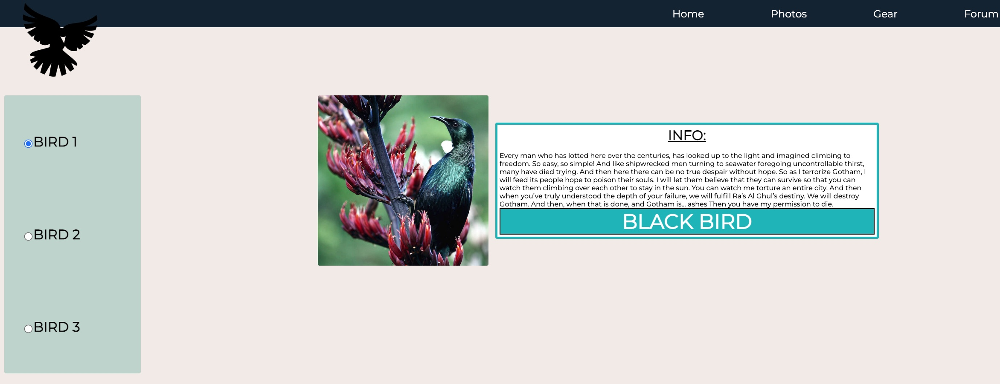

# Structured page

This is a page that I have created for the Awesome inc bootcamp week two.
Some of the technologies include:

- HTML5
- CSS3
- JAVASCRIPT


<br>
<br>

## Learnings:

- Learned about page srtuctures
  - Navigation Bar
  - Main content
  - sidebar
  - footer

During my debuging stage of sprint 2, this picture below shows what my week has looked like:


<br>
<br>


## More Learns:
Was able to use JS to loop through the DOM inorder to  add/remove classNames from HTML elements. Used functions such as:
```
document.getElementsByClassName('className');
//    This returns an array that is iterable in a forloop.


document.getElementbyId('classNamed');
//     This returns a single DOM element.


domElement.classList.add('classNameToAdd');
//    This allows you to append a className to an HTML element.


domElemet.classList.remove('classNameToRemove);
//    This allows you to remove a className from an HTML element. 

```